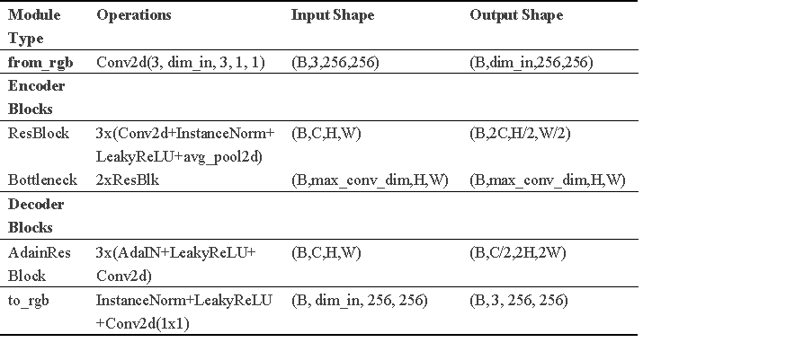
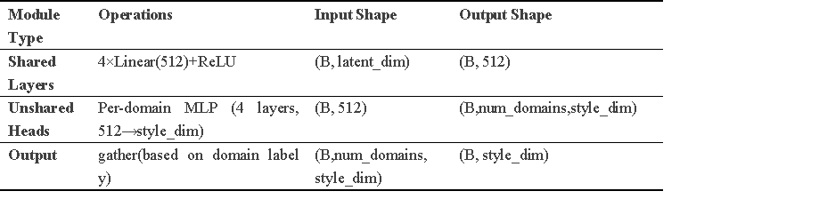
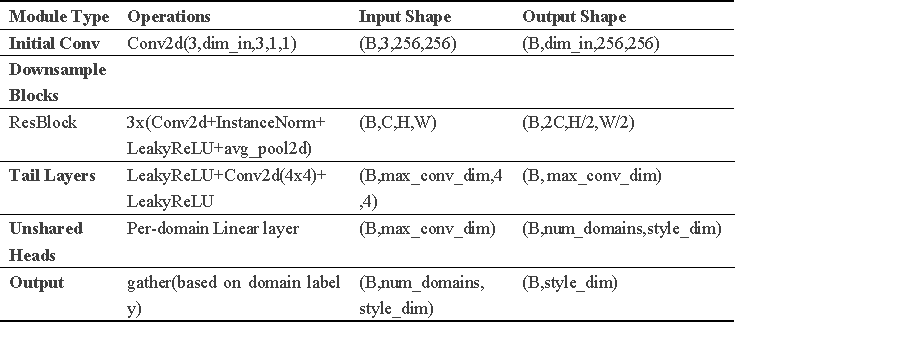
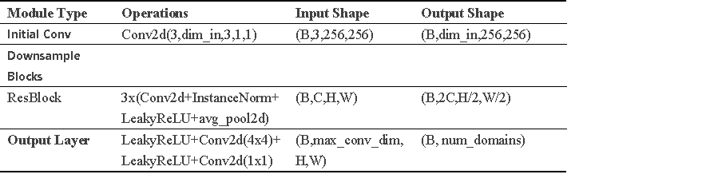
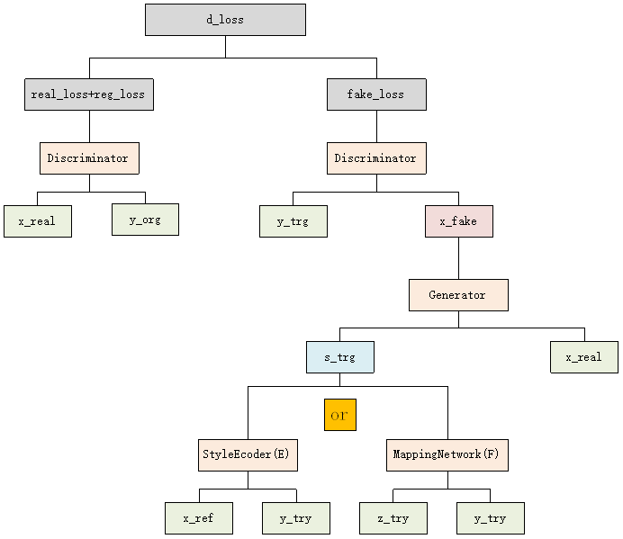
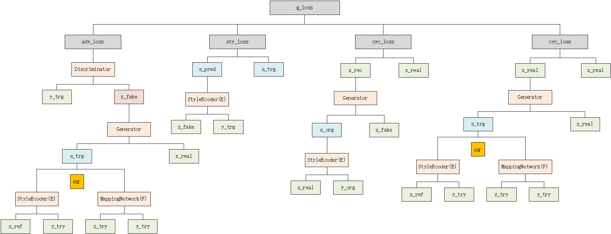
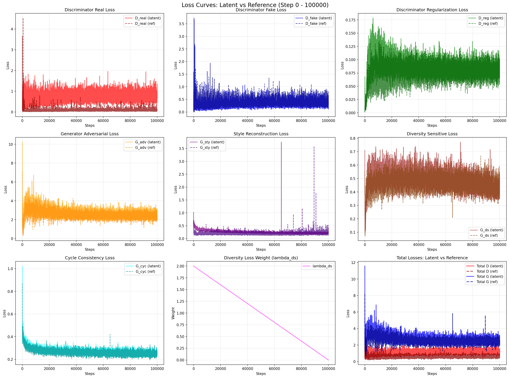
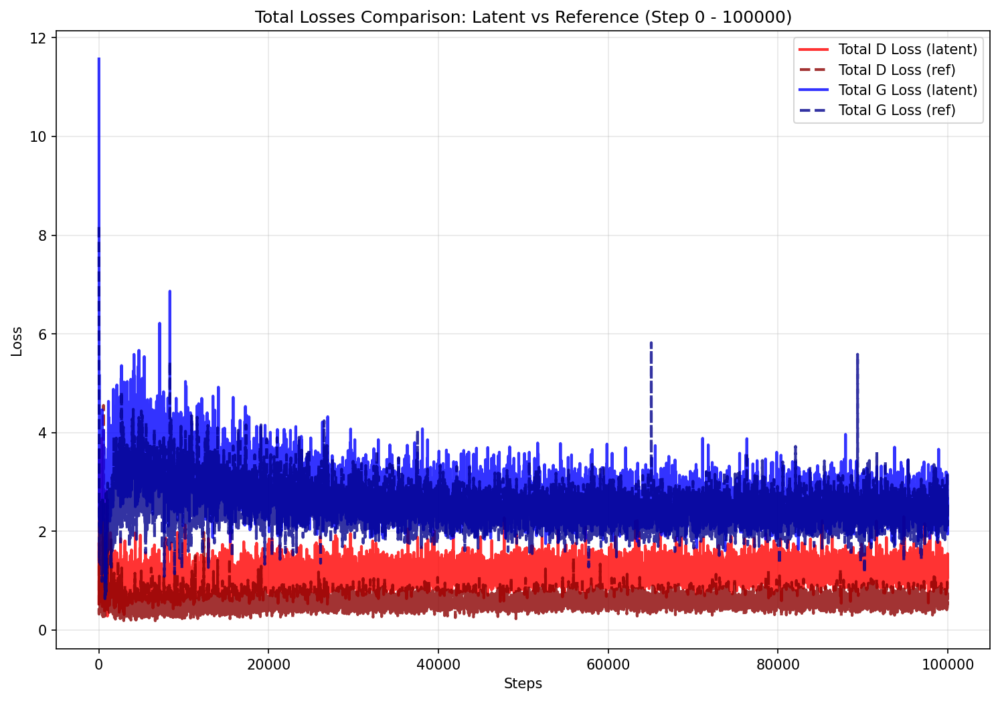
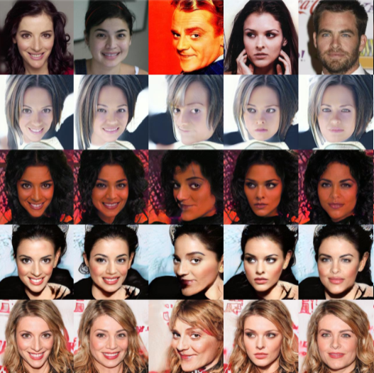
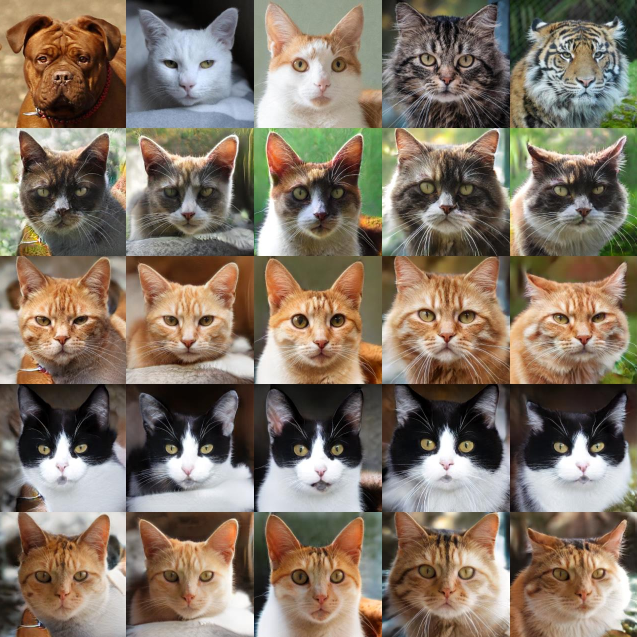

<div align="center">
# StarGAN v2 - Jittor Implementation

<div align="center">

**Jittor implementation of StarGAN v2**

*Diverse Image Synthesis for Multiple Domains*

[Original Paper](https://arxiv.org/abs/1912.01865) | [Official PyTorch Code](https://github.com/clovaai/stargan-v2)

[](https://www.python.org/downloads/release/python-380/)
[](https://cg.cs.tsinghua.edu.cn/jittor/)

</div>

---

## Contents

- [Overview](#overview)
- [Installation](#installation)
- [Datasets](#datasets)
- [Training](#training)
- [Inference](#inference)
- [Network Architecture](#network-architecture)
- [Loss Curves](#loss-curves)
- [Results](#results)
---

## Overview

StarGAN v2 is a scalable approach for diverse image-to-image translation across multiple domains. This repository provides a **complete Jittor implementation** migrated from the original PyTorch codebase, featuring:

### Key Features

- **Multi-Domain Translation**: Support for translating images across multiple domains
- **Diverse Generation**: Generate diverse outputs for the same input
- **Advanced Loss Monitoring**: Real-time loss tracking with automatic curve plotting
- **Jittor framework migration**: Full migration to Jittor framework

### Architecture Components

1. **Generator (G)**: Translates input images to target domain
2. **Mapping Network (F)**: Maps latent codes to style codes
3. **Style Encoder (E)**: Extracts style codes from reference images
4. **Discriminator (D)**: Distinguishes real from fake images


### Project File Structure

```txt
stargan-v2-master/
├── main.py                           # Main program entry (converted)
├── requirements.txt                  # Jittor dependencies
├── CONVERSION_REPORT_ch.md           # Jittor conversion report in Chinese
├── CONVERSION_REPORT_eng.md          # Jittor conversion report in English
├── README.md                         # Model Architecture and Performance Results
├── wing_trans.py                     # Wing.ckpt Model Conversion Script
├── core/
│   ├── model.py                      # Network model definitions (converted)
│   ├── solver.py                     # Training solver (converted and optimized)
│   ├── data_loader.py                # Data loaders (completely reconstructed)
│   ├── utils.py                      # Utility functions (converted)
│   ├── checkpoint.py                 # Checkpoint management (converted)
│   └── wing.py                       # FAN network (converted and fixed)
├── metrics/
│   ├── eval.py                       # Evaluation script (converted)
│   ├── fid.py                        # FID calculation (converted)
│   └── lpips.py                      # LPIPS calculation (converted)
├── assets/                           # Sample images
├── expr/                             # Experiment output directory
└── test_*.py                         # Various testing and validation scripts
```

---

## Installation

### Prerequisites

- Python 3.8+
- Jittor (latest version)
- CUDA 10.2+ (for GPU training)

### Quick Setup

```bash
#install manually
pip install -r requirements.txt
```

### Dependencies

```txt
jittor>=1.3.0
matplotlib>=3.5.0
opencv-python>=4.5.0
pillow>=8.0.0
scipy>=1.7.0
tqdm>=4.60.0
munch>=2.5.0
```

---

## Datasets

### Supported Datasets

- **CelebA-HQ**: High-resolution face images
- **AFHQ**: Animal faces (cats, dogs, wild animals)

### Data Structure

```
data/
├── celeba_hq/
│   ├── train/
│   │   ├── male/
│   │   └── female/
│   └── val/
│       ├── male/
│       └── female/
└── afhq/
    ├── train/
    │   ├── cat/
    │   ├── dog/
    │   └── wild/
    └── val/
        ├── cat/
        ├── dog/
        └── wild/
```

### Download Datasets

```bash
# Download CelebA-HQ
bash download.sh celeba-hq-dataset

# Download AFHQ
bash download.sh afhq-dataset
```

---

## Training

### Basic Training

```bash
# Train on CelebA-HQ
python main.py --mode train \
               --num_domains 2 \
               --w_hpf 1 \
               --lambda_reg 1 \
               --lambda_sty 1 \
               --lambda_ds 1 \
               --lambda_cyc 1 \
               --train_img_dir data/celeba_hq/train \
               --val_img_dir data/celeba_hq/val

# Train on AFHQ
python main.py --mode train \
               --num_domains 3 \
               --w_hpf 0 \
               --train_img_dir data/afhq/train \
               --val_img_dir data/afhq/val
```

### Training Parameters

| Parameter         | Default | Description                      |
| ----------------- | ------- | -------------------------------- |
| `--img_size`    | 256     | Input image resolution           |
| `--batch_size`  | 8       | Training batch size              |
| `--total_iters` | 100000  | Total training iterations        |
| `--lambda_sty`  | 1.0     | Style reconstruction loss weight |
| `--lambda_ds`   | 2.0     | Diversity loss weight            |
| `--lambda_cyc`  | 1.0     | Cycle consistency loss weight    |
| `--lambda_reg`  | 1.0     | R1 regularization weight         |

---

## Inference

### Reference-guided Synthesis

```bash
# Generate images using reference style
python main.py --mode sample \
               --num_domains 2 \
               --resume_iter 100000 \
               --w_hpf 1 \
               --checkpoint_dir expr/checkpoints/celeba_hq \
               --result_dir expr/results \
               --src_dir assets/representative/celeba_hq/src \
               --ref_dir assets/representative/celeba_hq/ref

```
---

## Network Architecture

### Individual Network Components

The StarGAN v2 architecture consists of four main components working together to achieve high-quality multi-domain image translation:

#### Generator (G)



**Purpose**: Translates source images to target domain while preserving source structure

**Architecture**:

- **Encoder**: ResNet-based encoder with instance normalization
- **Bottleneck**: Style-modulated residual blocks
- **Decoder**: AdaIN-based decoder with upsampling
- **High-pass Filter**: Optional HPF for preserving fine details

```python
# Key components
- Input: Source image (3 × H × W)
- Style injection: AdaIN layers throughout decoder
- Output: Translated image (3 × H × W)
- Parameters: ~26M (for 256×256 images)
```

#### Mapping Network (F)



**Purpose**: Maps random latent codes to style codes for diverse generation

**Architecture**:

- **Input**: Latent code z ∈ ℝ^16, Domain label y
- **Layers**: 4 fully connected layers with ReLU
- **Output**: Style code s ∈ ℝ^64
- **Domain-specific**: Separate output layers for each domain

```python
# Network structure
z (16) → FC(512) → ReLU → FC(512) → ReLU → 
FC(512) → ReLU → FC(512) → ReLU → 
Domain-specific FC(64) → s (64)
```

#### Style Encoder (E)



**Purpose**: Extracts style codes from reference images

**Architecture**:

- **Backbone**: ResNet-based feature extractor
- **Global Pooling**: Spatial dimensions reduced to 1×1
- **Domain-specific**: Separate output layers for each domain
- **Output**: Style code s ∈ ℝ^64

```python
# Processing pipeline
Reference image → Conv layers → ResBlocks → 
Global pooling → Domain-specific FC → Style code
```

#### Discriminator (D)



**Purpose**: Distinguishes real from fake images and provides domain classification

**Architecture**:

- **Multi-scale**: Operates on multiple image resolutions
- **PatchGAN**: Provides dense feedback across image patches
- **Domain-aware**: Outputs domain-specific scores
- **Regularization**: R1 gradient penalty for training stability

```python
# Network flow
Input image → Conv layers → ResBlocks → 
Domain-specific output → Real/Fake + Domain scores
```

### Training Flow

1. **Generator Training**:

   - Adversarial loss (fool discriminator)
   - Style reconstruction loss (consistency)
   - Diversity loss (encourage variation)
   - Cycle consistency loss (preserve content)
2. **Discriminator Training**:

   - Real/fake classification
   - R1 gradient penalty
   - Domain classification

---

## Loss Curves

### Training Dynamics

The training process is monitored through comprehensive loss tracking, with automatic curve generation every 10,000 steps.

### Loss Components Overview

#### Discriminator Losses



**Components**:

- **D_real**: Loss for real image classification
- **D_fake**: Loss for fake image detection
- **D_reg**: R1 regularization penalty
- **Latent vs Reference**: Comparison between two generation modes

#### Generator Losses



**Components**:

- **G_adv**: Adversarial loss (fool discriminator)
- **G_sty**: Style reconstruction consistency
- **G_ds**: Diversity sensitive loss (negative for diversity)
- **G_cyc**: Cycle consistency preservation
- **lambda_ds**: Dynamic diversity weight decay

### Detailed Training Curves

#### Complete Loss Analysis (100K Steps)



This comprehensive 3×3 comparison shows:

- **Top Row**: Discriminator losses (real, fake, regularization)
- **Middle Row**: Generator losses (adversarial, style, diversity)
- **Bottom Row**: Cycle consistency, lambda decay, and total losses

#### Total Loss Comparison



Simplified view showing the overall training dynamics:

- **Red Lines**: Discriminator losses (solid: latent, dashed: reference)
- **Blue Lines**: Generator losses (solid: latent, dashed: reference)
- **Convergence**: Both should stabilize and balance around 50K steps

### Monitoring Guidelines

- **Balanced Training**: D and G losses should be relatively balanced
- **Convergence**: Losses should stabilize after ~40k iterations
- **Training Collapse**: Avoid D losses approaching zero

---

## Results

### Generation Examples

#### CelebA-HQ Dataset Results



**Domain Transfer Examples**:

- **Male ↔ Female**: High-quality gender transformation
- **Diverse Generation**: Multiple variations from single input
- **Style Preservation**: Facial structure and identity maintained
- **Fine Details**: Hair texture, skin tone, facial features preserved

#### AFHQ Dataset Results



**Animal Domain Transfer**:

- **Anatomical Consistency**: Facial structure adapted appropriately
- **Texture Transfer**: Fur patterns and colors transformed naturally
- **Expression Preservation**: Original pose and expression maintained

### Quantitative Results

#### CelebA-HQ Results

| Method                        | FID (latent) | FID (reference) | LPIPS(latent) | LPIPS(reference) | Elapsed time |
| ----------------------------- | ------------ | --------------- | ------------- | ---------------- | ------------ |
| StarGAN v2 (PyTorch)          | 13.73        | 23.84           | 0.4515        | 0.3880           | 49min 51s    |
| **StarGAN v2 (Jittor)** | 13.64        | 22.56           | 0.4597        | 0.3976           | 42min 43s    |

#### AFHQ Results

| Method                        | FID (latent) | FID (reference) | LPIPS(latent) | LPIPS(reference) | Elapsed time |
| ----------------------------- | ------------ | --------------- | ------------- | ---------------- | ------------ |
| StarGAN v2 (PyTorch)          | 16.18        | 19.78           | 0.4501        | 0.4315           | 64min 49s    |
| **StarGAN v2 (Jittor)** | 17.09        | 20.61           | 0.4450        | 0.4157           | 55min 33s    |

</div>
